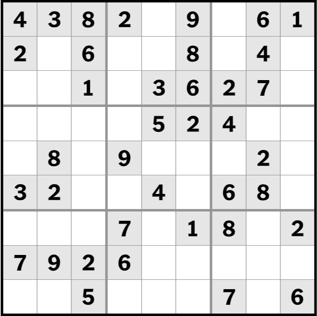
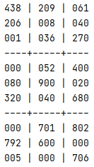
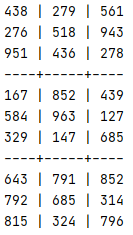
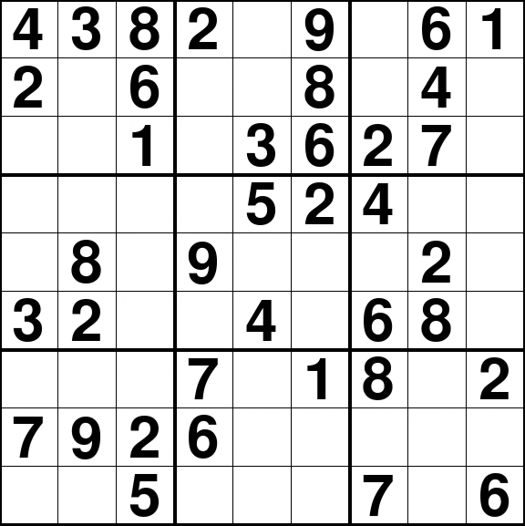

# SudokuSolver
Basic Sudoku puzzle solver using backtracking algorithm.

## Technologies
Python 3.8

## Approach
This uses a basic backtracking algorithm to solve any standard rules Sudoku puzzle. It takes as an input a string representation of a Sudoku puzzle, displays in the output the Sudoku layout of that puzzle, then displays the solved solution.

The format for the string is: 123456789/234567891/345678912/..., where each '/' signals a new row of numbers. A '0' is used for any unfilled spaces.

Here is an example of the 8/24/21 Sudoku puzzle from the New York Times:

This puzzle would translate in a string interpetation as:
"438209061/206008040/001036270/000052400/080900020/320040680/000701802/792600000/005000706". 

This outputs to the Python console as:

Which, once solved, outputs as:

This can be seen graphically through the gui.py file. Here is an example of it solving the puzzle above:

